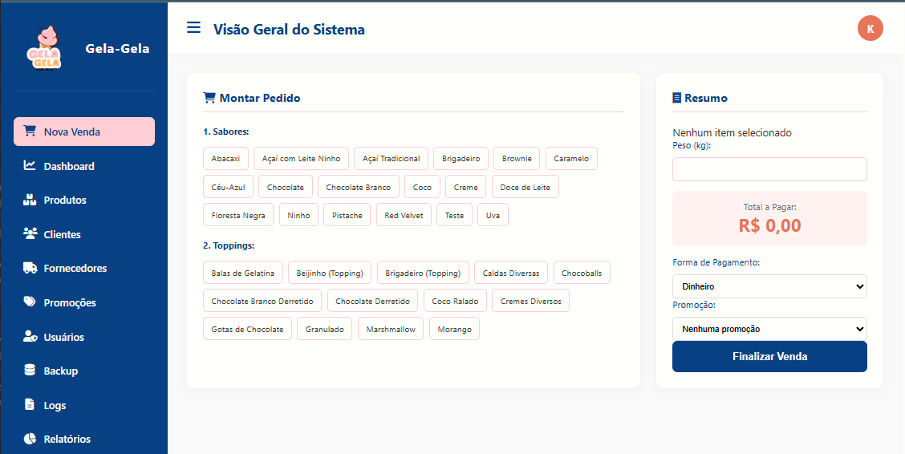
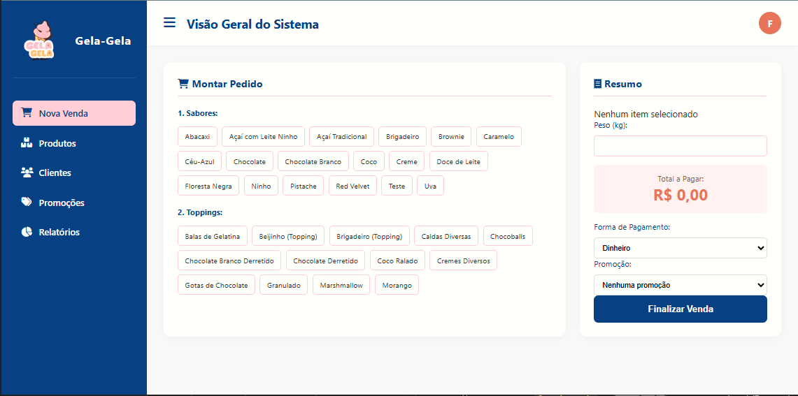

<h1 align="center">🍦 Gela-Gela System</h1>

  Sistema Avançado de Gestão, Controle de Estoque e Frente de Caixa (PDV) Inteligente para Sorveterias e Açaiterias

  
  
  

<h2><strong>Visão Geral</strong></h2>

O <strong>Gela-Gela System</strong> é uma plataforma robusta desenvolvida sob medida para otimizar os fluxos operacionais e financeiros de estabelecimentos de alta rotatividade de buffet de sorvetes e açaí. O software mitiga falhas humanas de inventário, automatiza cálculos complexos de precificação por peso e fornece uma barreira rigorosa de segurança operacional por níveis de acesso hierárquicos.

Projetado originalmente como um ecossistema integrado para a disciplina de <strong>Engenharia de Software II</strong> no <strong>IFSC - Câmpus Chapecó</strong>, a aplicação foi estruturada focando em usabilidade ágil no balcão de atendimento, alta integridade de dados via PDO e conformidade com as regras de negócio do estabelecimento.

<h2><strong>📸 Preview da Interface</strong></h2>

  <strong>Painel de Vendas (Visão: Gerente)</strong>

  

  <strong>Painel de Vendas (Visão: Funcionario)</strong>

  

<h2><strong>Funcionalidades e Regras de Negócio</strong></h2>

<h3>Controle Hierárquico de Acesso (RBAC)</h3>
<ul>
  <li><strong>Nível Funcionário:</strong> Permissão operacional focada na abertura de comandas, seleção ágil de sabores (17 opções nativas), inserção de toppings (13 opções) e finalização de vendas integradas com pesagem.</li>
  <li><strong>Nível Gerente:</strong> Controle irrestrito do ecossistema. Permite a exclusão/edição de produtos, ajuste mestre de tabelas de preço por quilo, gerenciamento completo de contas de colaboradores e auditoria de faturamento de forma exclusiva.</li>
</ul>

<h3>📊 Frente de Caixa Automatizado (PDV)</h3>
<ul>
  <li>Cálculo dinâmico e em tempo real do preço total com base na pesagem inserida.</li>
  <li>Mapeamento flexível de formas de pagamento tradicionais e digitais: Dinheiro, PIX, Cartão de Crédito e Cartão de Débito.</li>
  <li>Processamento em lote via JSON de múltiplos itens associados à mesma venda, minimizando a latência no banco de dados.</li>
</ul>

<h2><strong>🧰 Stack Tecnológica</strong></h2>

  <strong>Front-end:</strong> HTML5 Semântico, CSS3 Moderno, FontAwesome v6.0, JavaScript (Manipulação de DOM e processamento de dados). 
  <strong>Back-end:</strong> PHP (Arquitetura Modular, controle de sessões e segurança de rotas). 
  <strong>Persistência:</strong> MySQL estruturado com conexões seguras via <strong>PDO (PHP Data Objects)</strong>, prevenindo ataques de SQL Injection. 
  <strong>Infraestrutura:</strong> Servidor Local Apache via XAMPP.

<h2><strong>🔑 Credenciais Homologadas para Teste</strong></h2>

O ecossistema conta com perfis predefinidos na base de dados para validação imediata das regras de privilégios de acesso:

<table>
  <thead>
    <tr>
      <th align="left">Nível de Permissão</th>
      <th align="left">Usuário (Login)</th>
      <th align="left">Senha de Acesso</th>
      <th align="left">Acesso do Perfil</th>
    </tr>
  </thead>
  <tbody>
    <tr>
      <td>👑 <strong>Gerente</strong></td>
      <td><code>gerente</code></td>
      <td><code>Gerente@Gela</code></td>
      <td>Acesso irrestrito (Relatórios, Estoque, Gerenciamento de Usuários, Vendas).</td>
    </tr>
    <tr>
      <td>🛒 <strong>Funcionário</strong></td>
      <td><code>funcionario</code></td>
      <td><code>Func@Gela</code></td>
      <td>Acesso estritamente operacional (Frente de Caixa, Registro de Vendas).</td>
    </tr>
  </tbody>
</table>

<h2><strong>🚀 Guia de Instalação e Execução Local</strong></h2>

Siga os passos abaixo para implantar o projeto no seu ambiente de desenvolvimento local:

<h3>1️⃣ Pré-requisitos</h3>
<ul>
  <li><strong>XAMPP</strong> (com PHP 7.4 ou superior e servidor MySQL): <a href="https://www.apachefriends.org/pt_br/index.html" target="_blank">Download XAMPP</a></li>
  <li><strong>Git</strong> (para clonagem do repositório): <a href="https://git-scm.com/" target="_blank">Download Git</a></li>
</ul>

<h3>2️⃣ Clonagem e Estruturação de Pastas</h3>

Abra o seu terminal (Git Bash ou Prompt de Comando) e navegue até o diretório raiz do servidor local Apache do XAMPP:

<pre><code>cd C:\xampp\htdocs</code></pre>

Execute o comando de clonagem para criar a estrutura exata do projeto:

<pre><code>git clone https://github.com/Malagutt1/gela-gela-system-EngSoft-II.git</code></pre>

<h3>3️⃣ Importação do Banco de Dados</h3>
<ul>
  <li>Abra o painel do XAMPP e inicie os módulos <strong>Apache</strong> e <strong>MySQL</strong>.</li>
  <li>Acesse no seu navegador: <code>http://localhost/phpmyadmin/</code></li>

  <li>Clique na aba <strong>Importar</strong>, selecione o arquivo <code>sorveteria_db.sql</code> localizado na raiz do projeto e clique em <strong>Executar</strong>.</li>
</ul>

<h3>4️⃣ Execução</h3>

Após certificar-se de que a pasta do projeto chama-se exatamente <code>gela-gela-system-EngSoft-II</code> dentro de <code>htdocs</code>, abra seu navegador e digite o endereço das URLs amigáveis:

<pre><code>http://localhost/gela-gela-system-EngSoft-II/login</code></pre>

<h2><strong>👥 Equipe de Engenharia de Software</strong></h2>

Projeto concebido, modelado e implementado colaborativamente pela equipe técnica:

<table align="center">
  <tr>
    <td align="center" width="160" height="90">
      <code>&gt;_ Kauã</code>  
      Eng. Software
    </td>
    <td align="center" width="160" height="90">
      <code>&gt;_ Pedro</code>  
      Eng. Software
    </td>
    <td align="center" width="160" height="90">
      <code>&gt;_ Rikelme</code>  
      Eng. Software
    </td>
  </tr>
  <tr>
    <td align="center" width="160" height="90">
      <code>&gt;_ Victor</code>  
      Eng. Software
    </td>
    <td align="center" width="160" height="90">
      <code>&gt;_ Lucas</code>  
      Eng. Software
    </td>
    <td align="center" width="160" height="90">
      <code>&gt;_ David</code>  
      Eng. Software
    </td>
  </tr>
</table>

  🎓 <strong>Professores Orientadores:</strong> Prof. Ms. Marcos Virgilio & Dra. Lara Oberderfer 

  Desenvolvido com primor na disciplina de <strong>Engenharia de Software II</strong> 
  <strong>Instituto Federal de Santa Catarina (IFSC) — Câmpus Chapecó</strong> • 2026

